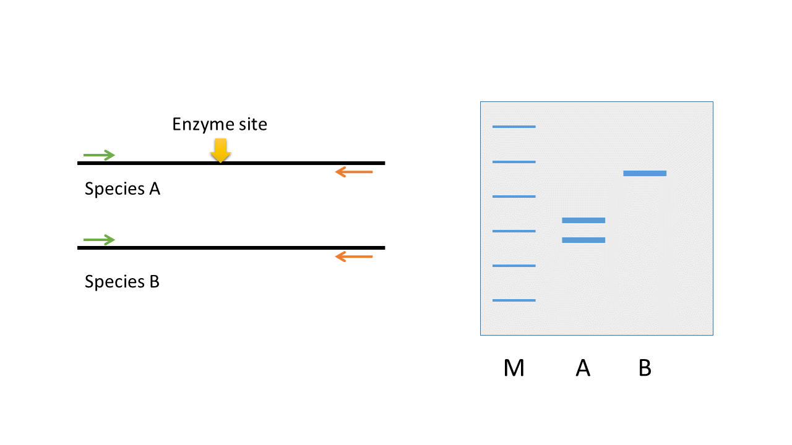

# BS32011/2 Bioinformatics practical overview

## Task: 
From published data design a PCR/digest experiment that will allow identification of mammalian species from mitochondrial DNA in scat.

### Background:
Observation of large mammals in Scotland is difficult. It requires considerable field craft and is time-consuming and expensive. A more convenient approach is to use surrogate measures such as scat, or droppings. Identification of species from fresh scat in the field is usually straightforward but often scat samples are older and reliable identification between two species of similar size and of similar habitat is not possible.
Animals shed epithelial cells in their scat, and the DNA from these can be recovered and amplified via PCR. The aim of this project is to design a suitable set of PCR primers that will allow the amplification of a region of the mitochondrial genome that contains a restriction enzyme site specific for one of a species pair but not the other (see figure 1.)

Figure 1. (left) A PCR primer pair amplifies mitochondrial sequence in both species A and species B. (right) Restriction digest with an enzyme which only has a site in the species A sequence gives rise to two possible banding patterns on a gel. (M – marker; A – species A; B – species B)
Procedure:
To complete this project successfully a number of bioinformatics tools will need to be used. The practical workflow is shown in figure 2. During the practical process, scripts and data will be maintained in a source code repository. Skill set: Source control with Git. Students will need to create an account at GitHub http://github.org

1 The first step is to identify appropriate sequence data for subsequent analysis. A web based search of the nucleotide database for the appropriate species at [NCBI](http://www.ncbi.nlm.nih.gov/nuccore) will suffice for that. A non-exhaustive list of mammalian species is shown in table 1.  Skill set: Understanding of sequence formats and database annotation to allow effective searching

|Common Name|	Latin Name|
|---|---|
|Red Fox|*Vulpes vulpes*|
|Pine Marten|*Martes martes*|
|Badger|*Meles meles*|
|Eurasian Beaver|*Castor fiber*|
|Black footed ferret|*Mustela nigripes*|
|Black ferret|*Mustela putorius furo*|
|Weasel|*Mustela altaicia*|
|European polecat|*Mustela putorius*|
|Eurasian River Otter|*Lutra lutra*|
|Sea Otter|*Enhydra lutris*|
|Stoat|*Mustela ermine*|
|Mink|*Mustela lutreola*|
|Cat|*Felis silvestris*|
|Red Squirrel|*Sciurus vulgaris*|
|Grey Squirrel|*Sciurus californiensis*|
|Brown Rat|*Rattus rattus norvegicus*|
|Dog	| *Canis lupus domesticus*|

Table 1. Selected carnivorous and other mammalian species

2 Following download, a sequence alignment should be performed. This is essential to ensure that the appropriate restriction sites can be matched. [Jalview](http://www.jalview.org) will be the preferred tool here. Skill set: importing and aligning sequences with Jalview. Preparation and presentation of multiple sequence alignments. There may be the need to adjust the sequences to ensure appropriate alignment of the circular genomes. This will either be performed with Unix shell or Python scripts.

3 The aligned sequences can then be searched for restriction enzyme cut sites. [EMBOSS](http://www.emboss.org) contains several tools that can achieve this using the [REBASE](http://www.rebase.org) data. Skill set: Use of Unix command line tools

4 Restriction enzyme sites need to be compared between the two species and unique sites retained. A Python script is the best option here. Skill set: String and set manipulation with Python. Python programming

5 The filtered set needs to be used to search for oligos with [Primer3](http://primer3.sourceforge.net/). A python script to generate Primer3 input data will be required. Skill set: Python scripting, Unix command line tools. Understanding file input formats.

6 Primer3 output will then be filtered to identify appropriate primer pairs that give resolvable fragments with the appropriate enzyme cut. Skill set: Python scripting

## Schedule:
The practical work should be straightforward and can be completed in a couple of days for an experienced student who is skilled with Python. Learning how to use Python will therefore be a significant part of the process for the majority of the students. The first two weeks have very little biological input – just a few hours at most. The rest of the time should be spent on learning the basics of Python. This will then be enhanced through processing the output files from EMBOSS and Primer 3 and generating input files for Primer 3.  The schedule below is indicative – it will change depending on how quickly the particular tasks are accomplished.

### [Week 1](week1.md) 
Introduction to the command line and Git 
Introduction to Python
Sequence identification and download

### [Week 2](week2.md)
More Python
Sequence alignment with Jalview
Restriction enzyme digest

### [Week 3](week3.md)
Site selection

### [Week 4](week4.md)
Primer prediction

### [Week 5](week5.md)
Candidate selection

## Lab environment and account registration
Much of the software needed is located on the standard university desktop. The remainder is available on the Life Sciences Bioinformatics teaching server. A detailed description of the lab environment is described [here](Software.md) including how to set the software up on your own machine and to register your username for the appropriate access.

## Group meetings
There will be two formal [group meetings[(meetings.md) each week. From the second week these will be managed entirely by the students. Students will take it in turns to act as chair, to present their current work, and to take minutes. 

## Lab books/Lab performance
Use your lab book as a daily journal in conjunction with the software repository. Guidelines on lab books and collaboration can be found [here](lab.md)